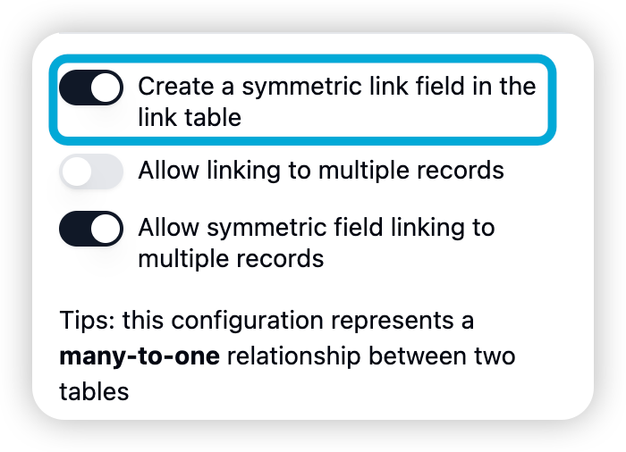

# Build a simple base

This article will guide you through creating an AI PDF Summary Base in Teable, step by step. This Base will help you manage PDF files and the data from PDF files organized by AI.

It might seem a bit complex for beginners, but I'll make the process as simple and understandable as possible. Let's tackle this task step by step.

#### Step One: Create Your Base

1. **Create a New Base**: After logging into your Teable account, click the "Create New Base" button on the interface. You have the option to start from scratch or use a template. In this example, we'll choose "Create Empty Database".

<figure><figcaption></figcaption></figure>

2. **Name Your Base**: After creating a new Base, click the dropdown button in the top left corner to rename it, entering “AI PDF Summary” as the name of your Base.

<figure><figcaption></figcaption></figure>

#### Step Two: Create the PDF List Table

**Creating the Table:**

After creating your Base, click the + sign on the left to create a table, and double-click the table name (default is “Table 1”) to rename it to “PDF List”.

**Adding Fields:**

After creating the table, you will see three default fields. First, delete the last two fields as they are not needed here.

<figure><figcaption></figcaption></figure>

* Rename the first field to FileName.
* Click the add field button, choose “Attachment”, and name the field “PDF” to store PDF files.

<figure><figcaption></figcaption></figure>

* Click the add field button, choose “Long Text”, and name the field “Text Content” to store the text content of the PDF files.
* Repeat the previous step, choose “Long Text”, and name the field “Summary” to store summaries of the PDF documents.
* Lastly, click the add field button, choose “Link to another table”, then choose “Create New Table”, and name it “PDF Category”. This will create a new table and link it to the “PDF List” table through the “Category” field. After that, select “Single Select”, as each PDF belongs to one category only.

<figure><figcaption></figcaption></figure>

**Step Three: Create the PDF Category Table**

Since the PDF Category table was automatically created in the previous step when creating the Category field, we now need to further configure it.

1. **Configure the PDF Category Table**:
   * Teable has automatically created a “Name” field for us, which we will use to store the names of categories.
   * **PDF List**: This field has also been automatically created, corresponding to the Category field in the PDF List table.
2. **Add Fields**:
   * **All Summary**: Click the add field button, choose “Lookup”, target table select “PDF List”, and from there select the “Summary” field. This will allow us to view summaries of all PDFs under each category in the PDF Category table.
   * **Count**: Click the add field button, choose “Rollup”, target table select “PDF List”, rollup field select “FileName”, and rollup type select “Count”. This will display the number of PDF files under each category.

**Step Four: Populate Data and Use Your Base**

Now that your Base framework is set up, you can start adding information about PDF files to the “PDF List” table. When you categorize a PDF file, Teable will automatically update related fields in the “PDF Category” table, such as All Summary and Count.

* **Add PDF File Information**: In the “PDF List” table, click to add a new row, then fill in the PDF file’s FileName, Text Content, and Summary. In the Category field, select an existing category or create a new one.
* **View Category Summaries**: Switch to the “PDF Category” table, and you can see the count of PDF files and the summaries of all PDFs under each category.

**Step Five: Optimization and Expansion**

As you become more familiar with using Teable, you might want to add more features or fields to meet your needs, such as:

* **Adding More Fields**: For example, adding “Upload Date”, “Author”, and other information for the PDF files.
* **Creating Views**: Teable allows you to create different views for your tables, such as grid view, calendar view, kanban view, etc., to view and manage your data in various ways.

**View Usage Example**

The current view filters out content with empty TextContent and groups items by Category for a better visual layout.

<figure><figcaption></figcaption></figure>

**Step Six: API Writing**

Our primary design goal for the current Base is to store text content and summaries generated by AI analysis of PDFs for easy retrieval later. We can design a workflow where PDFs are parsed through a third-party AI tool, and then the data is written back into cells using an API.

To write data using the Teable API, you first need to create an [Access Token](../developer/api/access-token.md), and then read the [API documentation](../developer/api/#api-documentation) and debug.

**Step Seven: Integrating Third-Party Platforms**

Once your Base has accumulated enough data, you might need to perform data insights and analysis, such as using an open-source data analysis tool like Metabase to create data reports and dashboards. Most data analysis tools support [Postgres connections](../developer/database-connection.md) to access data, so you can create a Postgres database connection directly in Teable, allowing third-party tools to read the data in your Base.

Similarly, if you need to build a customized application interface for collaboration with other co-workers, you can use open-source low-code software like AppSmith, flexibly reading and writing data through database connections + API.

Congratulations, you have now successfully created an AI PDF Summary Base and mastered the basics of using Teable. As you continue to practice, you'll be able to use Teable more flexibly to manage and analyze your data.
