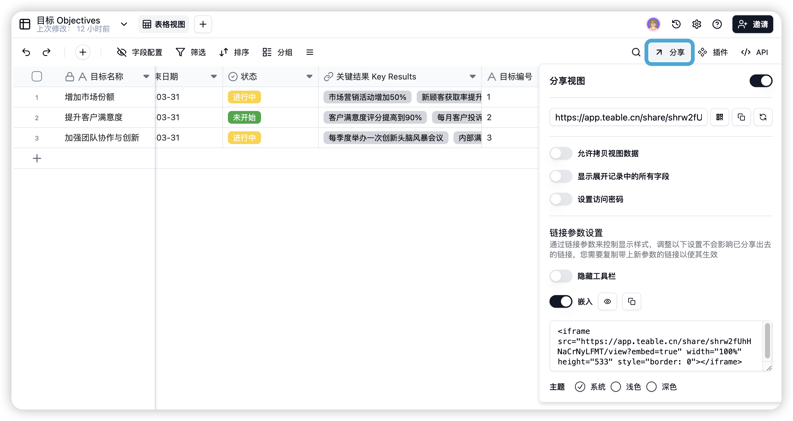
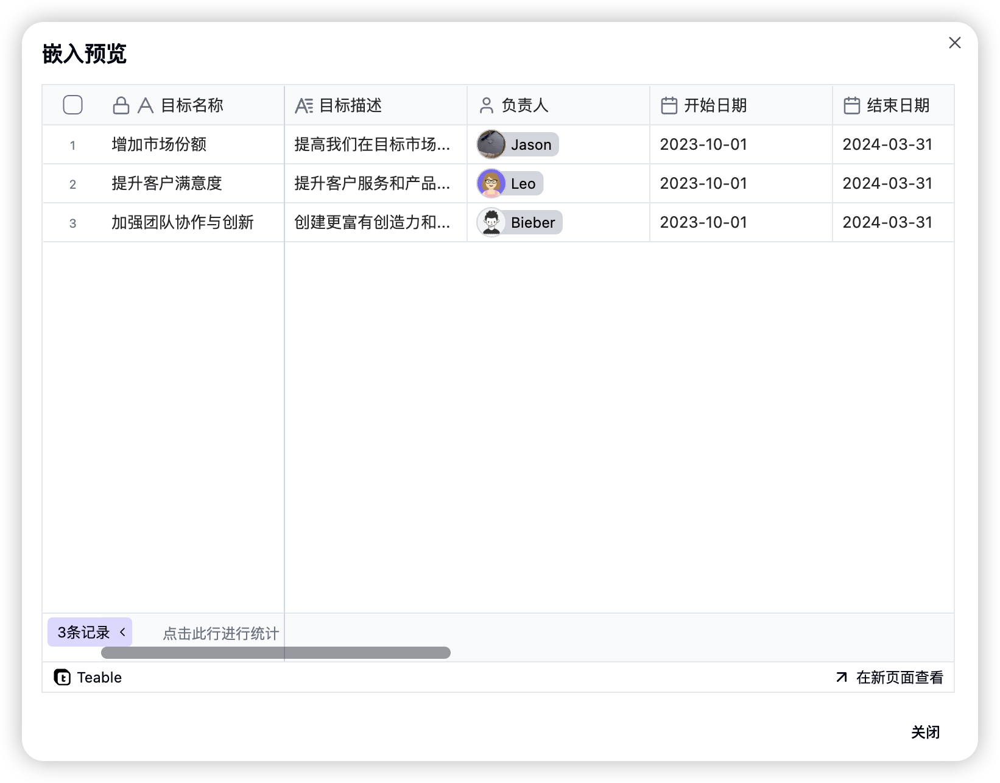

# v1.3.1 更新

### 1. 分享视图嵌入与自定义共享

Teable 新增了视图嵌入功能，并优化了共享设置：

1. 视图嵌入：现在您可以将视图嵌入到其他网页中。
2. 共享设置增强
   1. 可控制主题展示
   2. 可隐藏工具栏

操作步骤：

1. 打开目标表格，点击右上角"分享"按钮
2. 在弹出窗口中确认分享设置
3. 根据需求调整以下参数：
   1. 主题选择
   2. 工具栏显示
   3. 嵌入代码

<figure><figcaption></figcaption></figure>

<figure><figcaption></figcaption></figure>

通过新功能，您可以更灵活地控制共享内容的展示方式，提升协作效率
