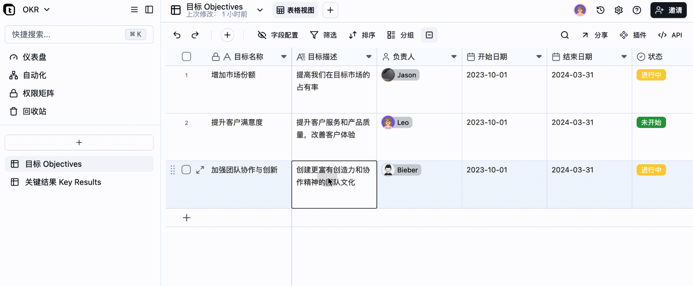

# v1.4.0 更新

### 撤销和重做

表格中的所有操作都可以撤销和重做。

<figure><figcaption></figcaption></figure>

### 共享数据库

您现在可以邀请协作者进入数据库进行协作，而无需进入空间内。

<figure><figcaption></figcaption></figure>

<figure><figcaption></figcaption></figure>
