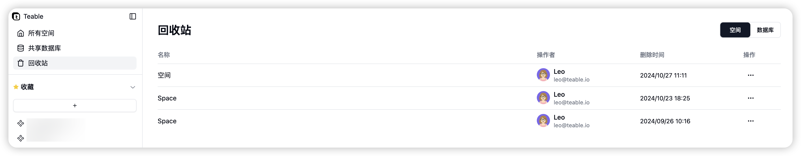
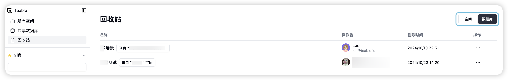
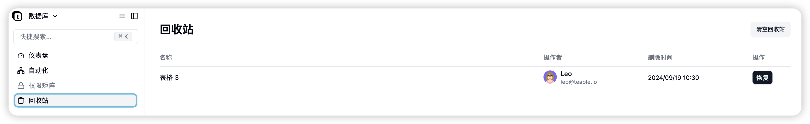

# v1.4.1 更新

#### 垃圾箱

您现在可以从回收站中恢复空间、数据库和表格！

<figure><figcaption></figcaption></figure>

<figure><figcaption></figcaption></figure>

<figure><figcaption></figcaption></figure>

#### 拖放附件顺序以重新排序

<figure><figcaption></figcaption></figure>
