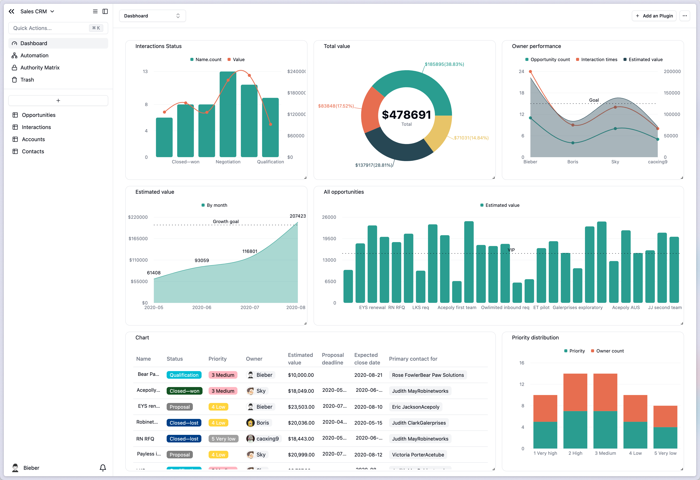

# v1.5.0 更新

### 仪表盘

<figure><figcaption></figcaption></figure>

#### 全面的图表类型

* 支持条形图/折线图/饼图/区域图/表格图表

<figure><figcaption></figcaption></figure>

#### 灵活的数据查询

* 支持选择/筛选/连接/排序/分组/聚合等查询配置

<figure><figcaption></figcaption></figure>

### 插件视图-Sheet表单

<figure><figcaption></figcaption></figure>

### [记录评论](https://help.teable.cn/ji-ben-gong-neng/ji-lu/ping-lun#zhu-yao-te-dian)

<figure><figcaption></figcaption></figure>

* realtime 实时对话
* 支持@提及功能
* 富文本编辑
* 支持图片和链接

\

### 分组统计

* 每个分组的统计

<figure><figcaption></figcaption></figure>

### 关联字段

#### 关联字段跨数据库关联

* 现在你可以自由地与任何数据库进行关联！
  * 编辑字段
  * 从其他数据库关联
  * 选择数据库与表格
  * &#x20; 例如：从数据库 **项目管理** 关联 产品任务管理

<figure><figcaption></figcaption></figure>

#### 从视图筛选记录

* 全面的权限控制，不用担心因关联而意外显示数据！ 控制从哪个视图关联记录；控制符合筛选条件的记录可以被链接；控制在关联选择列表中可以查看哪些字段。
  * 编辑字段
  * 更多配置
  * 选择视图/配置筛选条件

<figure><figcaption></figcaption></figure>

### 字段默认值

* 可以为大多数字段设置默认值

\

### 看板视图支持全字段分组

<figure><figcaption></figcaption></figure>

### 体验改进

* 附件字段图片预览速度大大提升
* 公式日期时间结果现在会与时区匹配
* 公式可以正确处理转义字符，如 "\n"
* 可以直接在附件列中选中的单元格上粘贴附件

\
