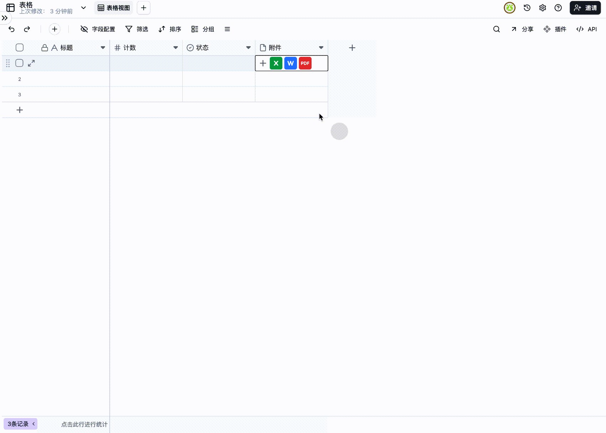

# v1.5.1 更新

### 1. 新增画册视图

我们很高兴地宣布，现在您可以在 Teable 中使用全新的画册视图功能。这一功能将为您提供更直观、更美观的数据展示方式。

#### 如何添加画册视图

1. 点击视图栏右侧的 「 + 」 号
2. 从弹出的选项中选择 「画册视图」

<figure><figcaption></figcaption></figure>

<figure><figcaption></figcaption></figure>

### 2. 附件预览功能增强

为了提高您的工作效率，我们优化了附件预览功能，使其支持更多文件类型。

#### 支持的文件类型

* PDF 文件
* Word 文档
* Excel 表格

#### 如何使用附件预览

1. 在附件栏中找到您想要预览的文件
2. 直接点击该文件
3. 文件预览将自动打开，无需下载即可查看内容

<figure><figcaption></figcaption></figure>

**注意**：预览功能旨在快速浏览文件内容，如需编辑，请下载原文件。

### 3. 记录复制功能优化

我们简化了记录复制的流程，为您提供了多种快捷方式。

#### 方法一：使用右键菜单

1. 右键点击您想要复制的记录
2. 在弹出的菜单中选择"复制记录"

<figure><figcaption></figcaption></figure>

#### 方法二：通过编辑表单

1. 打开您想要复制的记录的编辑表单
2. 点击表单中的"更多"按钮
3. 在下拉菜单中选择"复制记录"

<figure><figcaption></figcaption></figure>

**提示**：复制记录功能可以帮助您快速创建相似的记录，大大提高数据录入效率。

***

我们希望这些新功能和优化能够提升您的使用体验。如果您有任何问题或反馈，请随时与我们的支持团队联系。我们将继续努力，为您提供更好的产品和服务。
